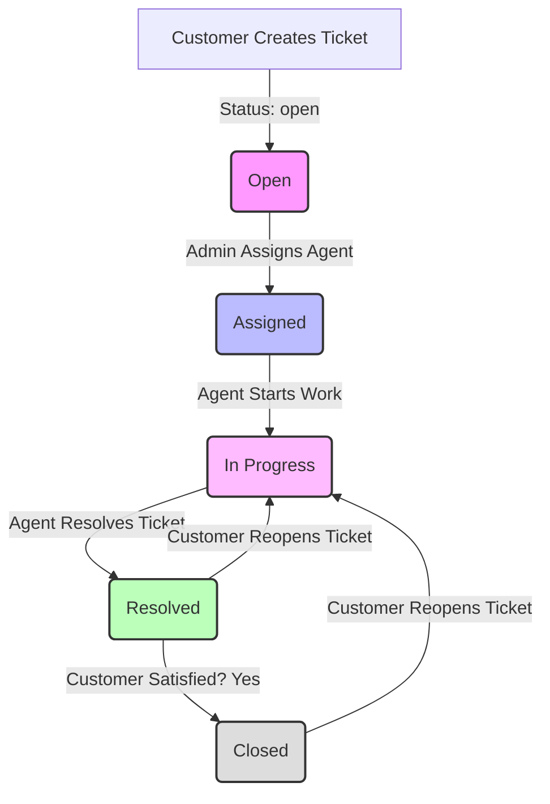

# ResolveDesk 🎫

> Every issue deserves an owner. Every conversation deserves a history. Every resolution deserves a closed loop.

**ResolveDesk** is a clean, role-based customer support and ticket resolution platform designed to streamline issue tracking, assignment, communication, and resolution. Built as a fully-featured **Java Spring Boot backend** backed by Supabase (Postgres) and a lightweight vanilla JS/CSS frontend, it ensures that no customer request gets lost in the noise.

---

## 👋 Why ResolveDesk?

Imagine a customer reports a critical bug. Someone says they'll "look into it." A few days pass, and nobody remembers who took ownership, what details were discussed, or whether the problem was actually fixed. Meanwhile, the customer is left in the dark.

**ResolveDesk fixes this.** It eliminates the ambiguity of ticket ownership and status by transforming every support request into a structured ticket.

Every ticket on ResolveDesk is tracked with:
- 👤 **Clear ownership:** Automatically mapped to the submitting customer and assigned agent.
- 🏷️ **Categorization & Priority:** Categorized by topic and flagged with a priority level (`low`, `medium`, `high`) to manage SLAs.
- 🔄 **Strict State Transitions:** A legal state machine ensures tickets progress systematically (from open to assigned, to in-progress, to resolved, and finally closed).
- 💬 **A Living Thread:** A chronological, real-time message stream between the customer and the assigned agent.
- 🔁 **Resolution History:** Reopening rules allow customers to kick a ticket back to `in_progress` if they aren't satisfied with the solution, complete with automated thread logs.

---

## 🎯 What does ResolveDesk do?

ResolveDesk organizes the entire support lifecycle into three key roles:

```
[ Customer ] ──( Creates ticket )──► [ Admin ] ──( Assigns Agent )──► [ Agent ]
     ▲                                                                   │
     │                                                                   ▼
[ Customer ] ◄──( Reviews & Closes/Reopens )── [ Agent ] ◄──( Works & Responds )
```

- **Customers:** Register, submit tickets, converse directly with agents in their dedicated ticket thread, and close or reopen tickets based on satisfaction.
- **Agents:** Access a paginated queue of assigned tickets, update statuses, converse with customers, and mark issues as resolved.
- **Admins:** View overall system analytics (average resolution time, workload breakdown, priority counts), monitor the master ticket stream, and assign unassigned tickets to agents based on workload.

---

## 🔄 How the system works

The ticket lifecycle follows a strict transition flow validated on the server. If a ticket tries to jump steps or change without an assigned agent, the API rejects it.



---

## 🛠️ The Tech Stack

ResolveDesk is built with a lightweight, high-performance tech stack focused on reliability and real-world scalability:

- **Backend:** Java Spring Boot (v2.7.18, Java 8 compatible)
- **Database Client:** Supabase REST Client utilizing Apache HttpClient for PATCH requests
- **Security & Auth:** JSON Web Tokens (JWT) & `jbcrypt` password hashing
- **Frontend:** Vanilla HTML5, CSS3 (Modern dark-themed system), and ES6 JavaScript
- **API Architecture:** RESTful JSON endpoints with custom RBAC filter interceptors

---

## 📂 Project Architecture

Here's a quick map of the repository's layout:

- [pom.xml](file:///v:/capstone%20prj/pom.xml) — The Maven project dependencies and build configuration.
- [src/main/java/com/helpdesk/](file:///v:/capstone%20prj/src/main/java/com/helpdesk/) — The core Spring Boot application codebase:
  - [HelpdeskApplication.java](file:///v:/capstone%20prj/src/main/java/com/helpdesk/HelpdeskApplication.java) — Main application entry point.
  - [config/WebConfig.java](file:///v:/capstone%20prj/src/main/java/com/helpdesk/config/WebConfig.java) — CORS registry and static resource handlers pointing to frontend.
  - [security/JwtInterceptor.java](file:///v:/capstone%20prj/src/main/java/com/helpdesk/security/JwtInterceptor.java) — Security intercepter implementing RBAC and JWT validation.
  - [service/SupabaseService.java](file:///v:/capstone%20prj/src/main/java/com/helpdesk/service/SupabaseService.java) — PostgREST service layer communicating with Supabase over HTTP.
  - [controller/](file:///v:/capstone%20prj/src/main/java/com/helpdesk/controller/) — REST Endpoints: AuthController, TicketController, AdminController.
- [server.js](file:///v:/capstone%20prj/server.js) — Lightweight reverse proxy to forward traffic from Node-based ports to the Java Spring Boot port.
- [public/](file:///v:/capstone%20prj/public/) — Frontend client codebase.
  - [index.html](file:///v:/capstone%20prj/public/index.html) — Portal login and sign-up interface.
  - [customer-dashboard.html](file:///v:/capstone%20prj/public/customer-dashboard.html) — Ticket creation and personal list view.
  - [agent-queue.html](file:///v:/capstone%20prj/public/agent-queue.html) — Work queue for assigned support staff.
  - [admin-dashboard.html](file:///v:/capstone%20prj/public/admin-dashboard.html) — Workload sorting, agent assignment, and system stats.
  - [ticket-detail.html](file:///v:/capstone%20prj/public/ticket-detail.html) — The interactive communication hub for any single ticket.
  - [api.js](file:///v:/capstone%20prj/public/api.js) — Shared fetch-based abstraction layer mapping to backend endpoints.
  - [style.css](file:///v:/capstone%20prj/public/style.css) — Custom responsive styling framework.

---

## 💾 Database Schema

The platform relies on four core tables in Supabase Postgres:

### 1. `users`
Tracks system identities and permissions.
- `id` (bigint/serial, Primary Key)
- `name` (text)
- `email` (text, Unique)
- `password_hash` (text)
- `role` (text: `'customer'`, `'agent'`, or `'admin'`)
- `created_at` (timestamp)

### 2. `tickets`
Tracks individual tickets and their current workflow state.
- `id` (bigint/serial, Primary Key)
- `title` (text)
- `category` (text)
- `priority` (text: `'low'`, `'medium'`, or `'high'`)
- `description` (text)
- `status` (text: `'open'`, `'assigned'`, `'in_progress'`, `'resolved'`, or `'closed'`)
- `customer_id` (foreign key -> `users.id`)
- `assigned_agent_id` (foreign key -> `users.id`, nullable)
- `created_at` (timestamp)
- `updated_at` (timestamp)
- `resolved_at` (timestamp, nullable)

### 3. `responses`
Maintains the communication threads for each ticket.
- `id` (bigint/serial, Primary Key)
- `ticket_id` (foreign key -> `tickets.id`)
- `sender_id` (foreign key -> `users.id`)
- `message` (text)
- `created_at` (timestamp)

### 4. `password_reset_tokens`
Manages secure OTP (One-Time Password) reset sessions.
- `id` (bigint/serial, Primary Key)
- `user_id` (foreign key -> `users.id`)
- `otp_hash` (text)
- `expires_at` (timestamp)
- `attempts` (integer)
- `verified` (boolean)
- `used` (boolean)
- `reset_token_hash` (text, nullable)
- `reset_expires_at` (timestamp, nullable)

---

## 🚀 Getting Started

Follow these steps to spin up the project locally:

### 1. Configure Environment Variables
Ensure the following variables are set in your environment (or defined in a `.env` file in the root directory for Node proxy settings):
```env
PORT=3000
JWT_SECRET=your_jwt_secret_key_here
SUPABASE_URL=https://your-project-id.supabase.co
SUPABASE_SECRET_KEY=your-supabase-service-role-or-secret-key
```

### 2. Compile & Run the Spring Boot Server
You can run Spring Boot using your local Java SDK environment.
In the project directory, run:
```bash
# Set JAVA_HOME to a valid JDK (JDK 8 or newer)
set JAVA_HOME=C:\Path\To\Your\JDK

# Compile and start the Spring Boot server (runs on port 8080 by default)
.\apache-maven-3.8.6\bin\mvn clean spring-boot:run
```

### 3. Start the Proxy Server (Optional)
If you wish to serve the application on the original Node.js port (`3000`), you can launch the lightweight Express proxy:
```bash
npm install
npm start
```

Open your browser and navigate to `http://localhost:8080` (or `http://localhost:3000` if using the proxy) to start using ResolveDesk!
