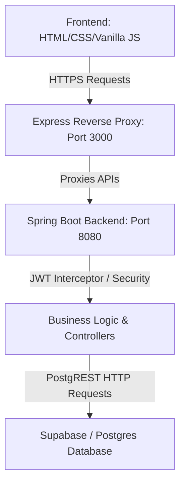
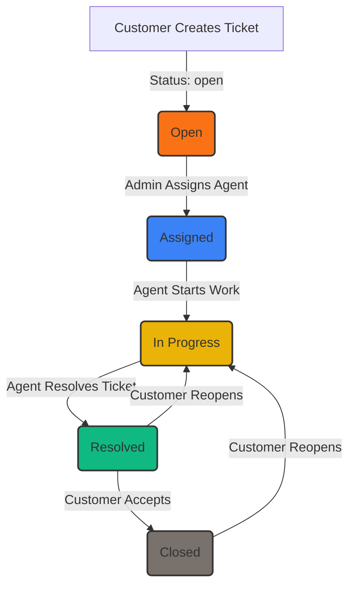
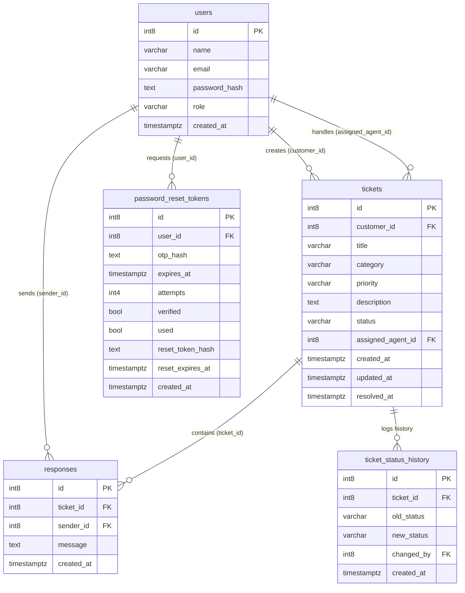

# ResolveDesk 🎫

Hey 👋 Welcome to **ResolveDesk**! Every issue deserves an owner, every conversation deserves a history, and every resolution deserves a closed loop. 

**ResolveDesk** is a clean, role-based customer support and ticketing platform designed to streamline issue tracking, assignment, communication, and resolution. Built with a high-performance **Java Spring Boot** backend communicating with **Supabase (Postgres)** via REST, and a sleek, modern **Vanilla JS & CSS** frontend, ResolveDesk is built for speed, safety, and reliability.

---

## 🔍 The Problem
Imagine a customer reports a critical bug. Someone says they'll "look into it." A few days pass, and nobody remembers who took ownership, what details were discussed, or whether the problem was actually fixed. Meanwhile, the customer is left in the dark, leading to a loss of trust.

## 💡 The Idea
We wanted to eliminate the ambiguity of support workflows. Every support request is turned into a structured ticket with:
- 👤 **Clear ownership:** Automatically mapped to the submitting customer and assigned agent.
- 🏷️ **Categorization & Priority:** SLA targets managed via priority levels (`low`, `medium`, `high`).
- 🔄 **Strict State Transitions:** A legal state machine validated on the server.
- 💬 **A Living Thread:** A chronological, real-time message stream between the customer and the assigned agent.

---

## 🚀 How It Works
The support ticket lifecycle follows a strict transition flow validated on the server. If a ticket tries to jump steps or change without an assigned agent, the API rejects it.

```
[ Customer ] ──( Creates ticket )──► [ Admin ] ──( Assigns Agent )──► [ Agent ]
     ▲                                                                   │
     │                                                                   ▼
[ Customer ] ◄──( Reviews & Closes/Reopens )── [ Agent ] ◄──( Works & Responds )
```

---

## 👥 User Roles & Permissions

- **Customers:**
  - Create and view their own tickets.
  - Chat in their ticket message threads.
  - Accept resolutions (marks ticket as `CLOSED`) or Reopen tickets (marks ticket as `IN_PROGRESS` with a required reason comment).
- **Agents:**
  - View their assigned tickets queue.
  - Send replies in ticket threads.
  - Transition tickets from `assigned` ➔ `in_progress` ➔ `resolved`.
- **Admins:**
  - View all tickets in the system.
  - Assign or reassign tickets to agents.
  - Monitor workload metrics and analytics.

---

## 🛠️ Key Features
- **OTP Password Reset:** Supports secure verification code flows for users who forgot their passwords.
- **Glassmorphic Resolution Modal:** Prompting customers to supply a non-empty reason when reopening tickets.
- **State History Tracking:** Automatically records transitions in a `ticket_status_history` table.
- **Role-Based Access Control (RBAC):** Strict JWT verification and role validation interceptor on the backend.

---

## 🏗️ System Architecture



---

## 🔄 Workflow Diagram



---

## 💾 Database Structure

We utilize four core tables and a history table in Supabase Postgres:



---

## 🔌 API Overview

| Method | Endpoint | Authentication | Role Allowed | Purpose |
| :--- | :--- | :--- | :--- | :--- |
| `POST` | `/auth/signup` | None | Anyone | User account registration |
| `POST` | `/auth/login` | None | Anyone | Authenticates credentials and returns JWT token |
| `POST` | `/tickets` | JWT | `customer` | Submits a new support ticket |
| `GET` | `/tickets/my` | JWT | `customer` | Lists all tickets owned by the current customer |
| `GET` | `/tickets/queue` | JWT | `agent` | Paginated queue of tickets assigned to the agent |
| `GET` | `/tickets/{id}` | JWT | Owner/Assignee/Admin | Retrieves full ticket details and thread comments |
| `POST` | `/tickets/{id}/respond` | JWT | Owner/Assignee/Admin | Posts a comment response to the ticket thread |
| `PATCH` | `/tickets/{id}/status` | JWT | `agent`, `admin` | Updates status (e.g. starting work or resolving) |
| `PATCH` | `/tickets/{id}/assign` | JWT | `admin` | Assigns/Reassigns the ticket to a support agent |
| `PATCH` | `/tickets/{id}/reopen` | JWT | `customer` (Owner) | Reopens a resolved or closed ticket (requires reason) |
| `PATCH` | `/tickets/{id}/close` | JWT | `customer` (Owner) | Accepts resolution and closes ticket |

---

## 📂 Project Structure
- [pom.xml](file:///v:/capstone%20prj/pom.xml) — Maven project configuration.
- [src/main/java/com/helpdesk/](file:///v:/capstone%20prj/src/main/java/com/helpdesk/) — Java Spring Boot backend codebase.
  - [controller/](file:///v:/capstone%20prj/src/main/java/com/helpdesk/controller/) — REST Endpoint controllers.
  - [security/](file:///v:/capstone%20prj/src/main/java/com/helpdesk/security/) — JWT Interceptor configuration and helpers.
  - [service/](file:///v:/capstone%20prj/src/main/java/com/helpdesk/service/) — RestTemplate-based Supabase PostgREST client service.
- [server.js](file:///v:/capstone%20prj/server.js) — Lightweight reverse proxy to expose API and serve frontend static assets.
- [public/](file:///v:/capstone%20prj/public/) — Frontend client codebase: HTML, API client, and CSS style tokens.
- [test-phase9-resolution.js](file:///v:/capstone%20prj/test-phase9-resolution.js) — Phase 9 validation test suite.

---

## 🛡️ Security
- **Strict JWT RBAC:** Requests to protected paths intercept tokens and reject unauthorized roles.
- **Salting & Hashing:** Passwords hashed with `jbcrypt` (backend) and `bcryptjs` (dev tests).
- **Secure Credentials:** All Supabase URLs and Secret Keys are loaded via environment variables and never committed.

---

## 🧪 Testing

### Running Tests
Execute the end-to-end resolution flow test suite:
```bash
node test-phase9-resolution.js
```

---

## 🚀 Getting Started

### 1. Environment Configuration
Create a `.env` file in the root folder with:
```env
PORT=3000
JWT_SECRET=your_jwt_secret_key
SUPABASE_URL=https://your-project.supabase.co
SUPABASE_SECRET_KEY=your-supabase-service-role-secret-key
```

### 2. Spring Boot Server
Launch the Java Spring Boot backend:
```bash
$env:JAVA_HOME="C:\Program Files\JetBrains\IntelliJ IDEA 2026.2.0.1\jbr"
.\apache-maven-3.8.6\bin\mvn clean spring-boot:run
```

### 3. Node Proxy
Run the reverse proxy:
```bash
npm install
npm start
```
Navigate to `http://localhost:3000` to start using ResolveDesk!

---

## 📈 Future Improvements
- **Live Ticket Updates:** Integrating WebSockets for instantaneous real-time chat threads.
- **SLA Violation Alerts:** Automatic emails to admins when ticket resolution exceeds target windows.

## 🎓 What I Learned
- Integrating RestTemplate in Spring Boot to directly interact with Supabase PostgREST endpoints.
- Designing strict legal state transitions in server-side controller APIs.

## 📌 Project Status
Completed & Capstone Ready.

## 👤 Author
Developed by Viraj.
