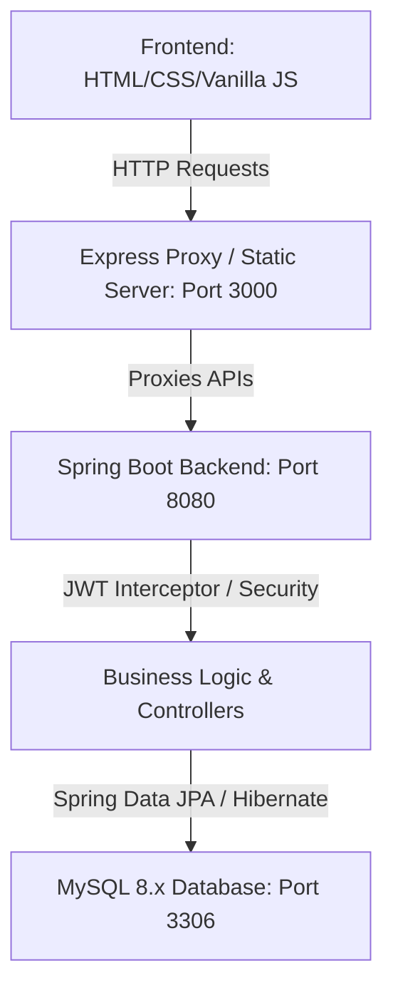
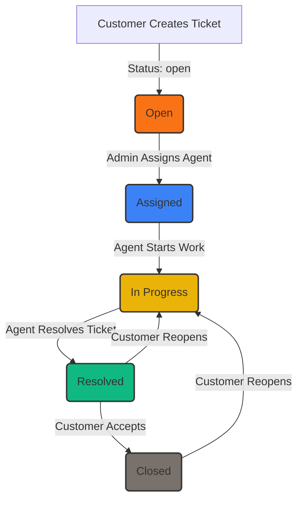
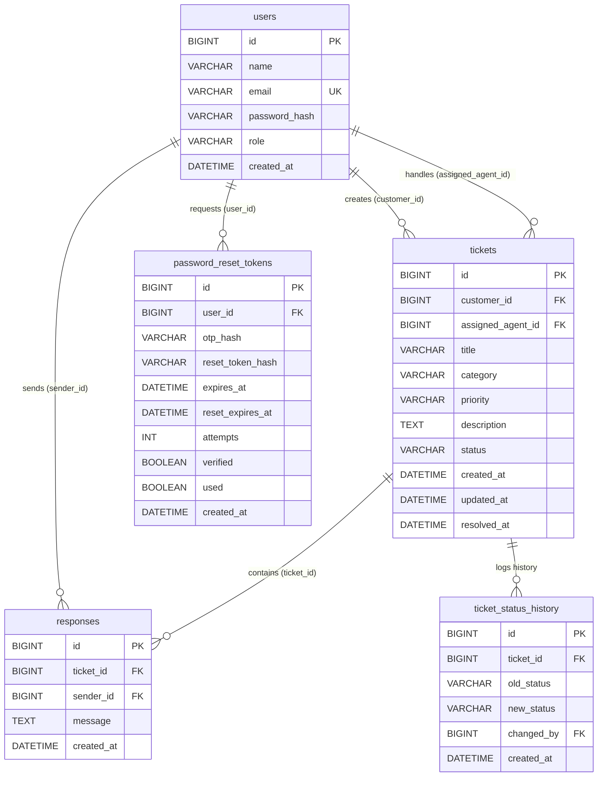

# ResolveDesk 🎫

Hey 👋 Welcome to **ResolveDesk**! Every issue deserves an owner, every conversation deserves a history, and every resolution deserves a closed loop. 

🌐 **Live Demo:** [https://resolvedesk-gvuw.onrender.com/](https://resolvedesk-gvuw.onrender.com/)

**ResolveDesk** is a clean, role-based customer support and ticketing platform designed to streamline issue tracking, assignment, communication, and resolution. Built with a high-performance **Java Spring Boot (Data JPA & Hibernate)** backend connected directly to **MySQL 8.x**, and a sleek, modern **Vanilla JS & CSS** frontend, ResolveDesk is built for speed, safety, and reliability.

---

## ⚡ Live Production URL & Demo Credentials

| Attribute | Details |
| :--- | :--- |
| **Live App URL** | [https://resolvedesk-gvuw.onrender.com/](https://resolvedesk-gvuw.onrender.com/) |
| **Admin Login** | `admin@resolvedesk.com` / `Admin@123456` |
| **Support Agent Login** | `agent@resolvedesk.com` / `Agent@123456` |
| **Customer Login** | `customer@resolvedesk.com` / `Customer@123456` |
| **Database** | TiDB Serverless Cloud MySQL Cluster (AWS Singapore) |

---

## 🔍 The Problem
Imagine a customer reports a critical bug. Someone says they'll "look into it." A few days pass, and nobody remembers who took ownership, what details were discussed, or whether the problem was actually fixed. Meanwhile, the customer is left in the dark, leading to a loss of trust.

## 💡 The Idea
We wanted to eliminate the ambiguity of support workflows. Every support request is turned into a structured ticket with:
- 👤 **Clear ownership:** Automatically mapped to the submitting customer and assigned agent.
- 🏷️ **Categorization & Priority:** SLA targets managed via priority levels (`low`, `medium`, `high`).
- 🔄 **Strict State Transitions:** A legal state machine validated on the server.
- 💬 **A Living Thread:** A chronological, real-time message stream between the customer and the assigned agent.

---

## 🚀 How It Works
The support ticket lifecycle follows a strict transition flow validated on the server. If a ticket tries to jump steps or change without an assigned agent, the API rejects it.

```
[ Customer ] ──( Creates ticket )──► [ Admin ] ──( Assigns Agent )──► [ Agent ]
     ▲                                                                   │
     │                                                                   ▼
[ Customer ] ◄──( Reviews & Closes/Reopens )── [ Agent ] ◄──( Works & Responds )
```

---

## 👥 User Roles & Permissions

- **Customers:**
  - Create and view their own tickets.
  - Chat in their ticket message threads.
  - Accept resolutions (marks ticket as `CLOSED`) or Reopen tickets (marks ticket as `IN_PROGRESS` with a required reason comment).
- **Agents:**
  - View their assigned tickets queue.
  - Send replies in ticket threads.
  - Transition tickets from `assigned` ➔ `in_progress` ➔ `resolved`.
- **Admins:**
  - View all tickets in the system with search/filtering.
  - Assign or reassign tickets to agents.
  - Monitor workload metrics, resolution stats, and analytics.

---

## 🛠️ Key Features
- **OTP Password Reset:** Supports secure verification code flows for users who forgot their passwords.
- **Glassmorphic Resolution Modal:** Prompting customers to supply a non-empty reason when reopening tickets.
- **State History Tracking:** Automatically records transitions in a `ticket_status_history` table.
- **Role-Based Access Control (RBAC):** Strict JWT verification and role validation interceptor on the backend.
- **Native MySQL Persistence:** High performance Spring Data JPA / Hibernate ORM with relational integrity and auto-indexing.
- **Supabase to MySQL Migration Tool:** Built-in automated script to migrate data from Supabase to MySQL.

---

## 🏗️ System Architecture



---

## 🔄 Workflow Diagram



---

## 💾 Database Structure (MySQL 8.x)



---

## 🔌 API Overview

| Method | Endpoint | Authentication | Role Allowed | Purpose |
| :--- | :--- | :--- | :--- | :--- |
| `POST` | `/auth/signup` | None | Anyone | User account registration |
| `POST` | `/auth/login` | None | Anyone | Authenticates credentials and returns JWT token |
| `POST` | `/auth/forgot-password` | None | Anyone | Sends 6-digit OTP verification code |
| `POST` | `/auth/verify-otp` | None | Anyone | Validates OTP and issues reset token |
| `POST` | `/auth/reset-password` | None | Anyone | Updates password using reset token |
| `POST` | `/tickets` | JWT | `customer` | Submits a new support ticket |
| `GET` | `/tickets/my` | JWT | `customer` | Lists all tickets owned by current customer |
| `GET` | `/tickets/queue` | JWT | `agent` | Paginated queue of tickets assigned to agent |
| `GET` | `/tickets/{id}` | JWT | Owner/Assignee/Admin | Retrieves full ticket details and thread comments |
| `POST` | `/tickets/{id}/respond` | JWT | Owner/Assignee/Admin | Posts a comment response to the ticket thread |
| `PATCH` | `/tickets/{id}/status` | JWT | `agent`, `admin` | Updates status (e.g. starting work or resolving) |
| `PATCH` | `/tickets/{id}/assign` | JWT | `admin` | Assigns/Reassigns the ticket to a support agent |
| `PATCH` | `/tickets/{id}/reopen` | JWT | `customer` (Owner) | Reopens a resolved or closed ticket (requires reason) |
| `PATCH` | `/tickets/{id}/close` | JWT | `customer` (Owner) | Accepts resolution and closes ticket |
| `GET` | `/admin/tickets` | JWT | `admin` | Filtered and paginated list of all tickets |
| `GET` | `/admin/agents` | JWT | `admin` | List of agents and their active ticket workload |
| `GET` | `/admin/stats` | JWT | `admin` | Overall counts and average resolution time |
| `GET` | `/admin/analytics` | JWT | `admin` | Comprehensive metrics and charts data |

---

## 📂 Project Structure
- [pom.xml](file:///v:/capstone%20prj/pom.xml) — Maven configuration with Spring Data JPA & MySQL Connector.
- [mysql_schema_seed.sql](file:///v:/capstone%20prj/mysql_schema_seed.sql) — Full MySQL 8.x schema and demonstration seed data.
- [src/main/java/com/helpdesk/](file:///v:/capstone%20prj/src/main/java/com/helpdesk/) — Java Spring Boot backend codebase:
  - [entity/](file:///v:/capstone%20prj/src/main/java/com/helpdesk/entity/) — JPA Entities (`User`, `Ticket`, `TicketResponse`, `PasswordResetToken`, `TicketStatusHistory`).
  - [repository/](file:///v:/capstone%20prj/src/main/java/com/helpdesk/repository/) — Spring Data JPA Repositories.
  - [controller/](file:///v:/capstone%20prj/src/main/java/com/helpdesk/controller/) — REST Endpoint controllers.
  - [security/](file:///v:/capstone%20prj/src/main/java/com/helpdesk/security/) — JWT Interceptor and token generation.
- [server.js](file:///v:/capstone%20prj/server.js) — Reverse proxy and static file server.
- [public/](file:///v:/capstone%20prj/public/) — Frontend client codebase: HTML, API client, and CSS style tokens.
- [scripts/](file:///v:/capstone%20prj/scripts/) — Utility scripts:
  - `migrate-supabase-to-mysql.js` — Automated data migration from Supabase to MySQL.
  - `seed-admin.js` — Direct MySQL admin seeding script.
  - `cleanup-db.js` — Direct MySQL test cleanup script.

---

## 🚀 Getting Started

### 1. Configure Environment (`.env`)
Create or edit your `.env` file:
```env
# MySQL Database
MYSQL_HOST=localhost
MYSQL_PORT=3306
MYSQL_DATABASE=resolvedesk
MYSQL_USER=root
MYSQL_PASSWORD=your_mysql_password

# Application Settings
JWT_SECRET=your_jwt_secret_key
PORT=3000
```

### 2. Initialize Database (Optional)
Run the MySQL script if you want initial seed data:
```bash
mysql -u root -p < mysql_schema_seed.sql
```
*(Alternatively, Spring Boot JPA will automatically create and update tables on startup)*

### 3. Migrate Existing Supabase Data (Optional)
If you have existing data in Supabase that you want to copy into MySQL:
```bash
npm run migrate:supabase
```

### 4. Run Spring Boot Backend
```bash
mvn spring-boot:run
```

### 5. Start Frontend Proxy
```bash
npm start
```
Navigate to `http://localhost:3000` to access ResolveDesk!

---

## 🛡️ Security
- **Strict JWT RBAC:** Requests to protected paths intercept tokens and reject unauthorized roles.
- **Salting & Hashing:** Passwords hashed with `jbcrypt` (backend) and `bcryptjs` (dev scripts).
- **Secure Credentials:** MySQL credentials and JWT secret loaded via environment variables.

---

## 👤 Author
Developed by Viraj.
